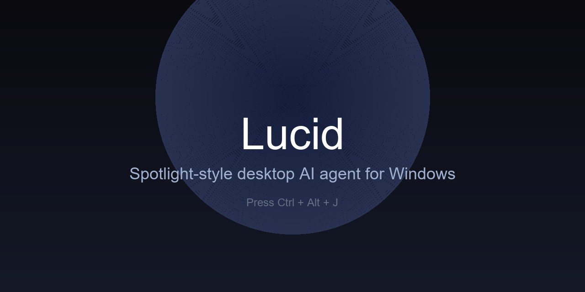

# Lucid

> **Spotlight-style desktop AI agent for Windows.** Press `Ctrl+Alt+J`, type what you want, and let Claude see your screen, click, type, and scroll until the job is done. Open source, MIT licensed, API-key-or-Claude-Code-CLI.




---

## What Lucid does

Lucid is an always-on tray app that turns your whole desktop into a workspace for a vision LLM. No app-specific integrations, no sign-in flows. Every running program, every file dialog, every browser tab — the model sees what you see and operates the mouse and keyboard directly.

Three modes, one prompt bar (Ctrl+1/2/3 to switch, or Tab to cycle):

| Mode | What it does | When to use |
| --- | --- | --- |
| **Answer** | Vision Q&A over the current screen. No actions, just text. | "What's this error?", "Write a formula for column D", "Summarise this PDF." |
| **Teach** | Record a task once with mouse + keyboard, save as a **named workflow** with variables. Every replay re-plans against the live screen. | Invoice creation, data entry, anything repetitive. |
| **Execute** | Full autonomy: Claude drives the desktop. 16+ native actions — click, type, drag, focus window, click by label, file-dialog paste, screenshot to clipboard, shell peek, captcha solver. | "Open Gmail and send X to Y", "Find all PDFs and zip them", "Open Excel and fill these rows". |

---

## Quick start

### 1. Install

```powershell
git clone https://github.com/ertugrulakben/lucid
cd lucid
uv sync --all-extras
```

### 2. Configure

Copy the profile template and fill in your details:

```powershell
copy profile.example.yaml data\profile.yaml
notepad data\profile.yaml
```

Store your Anthropic API key once in the OS keyring (never in plain text):

```powershell
uv run lucid setup
```

Prefer zero API cost? Lucid also supports the Claude Code CLI as a backend — set `backend.mode: cli` in `data/settings.yaml` and every Answer/Teach request goes through your existing Claude subscription.

### 3. Run

```powershell
uv run lucid
```

A tray icon appears. Press **`Ctrl+Alt+J`** anywhere — the overlay pops up. Type what you want, pick a mode, hit Enter. The overlay docks to the top-right during Execute mode so you can watch progress while Claude works.

---

## Feature highlights

### Semantic actions, not pixel guessing
Claude prefers labelled interactions: `click_element "Send"`, `focus_window "Gmail"`, `file_dialog_paste "C:\path\to.pdf"`. Pixel clicks are a last-resort fallback, not the default. When the model insists on a coordinate, Lucid's retry guard catches same-bucket repeats (±30 px) and nudges it to a different strategy.

### Native screenshot to clipboard
Forget `PrintScreen`/`Win+Shift+S` dances. `screenshot_to_clipboard` captures the screen (or a specific monitor, or a region) directly into the Windows clipboard as a DIB. Paste it into Photoshop, Word, Outlook, any app that accepts an image — zero UI flicker.

### Shell peek
Need to know "where is this file" or "is this process running"? `run_shell` executes a short read-only command (`dir`, `Get-Process`, `where.exe`) in 10 s with a destructive-pattern denylist. No need to open a terminal.

### Named workflows with variables
Teach once, parameterise forever.

```powershell
lucid teach   # record an invoice flow once
# ...do the task manually...
# Workflow saved as "create_invoice" with {{customer}}, {{amount}}, {{date}}

lucid run create_invoice --var customer="Acme Inc." --var amount="1250"
```

Workflows live in `data/workflows/` as JSON. Each replay re-plans the steps against the live screen via semantic intent, so UI drift (new theme, resized window) doesn't break them.

### Scheduled tasks
Cron, intervals, one-shot, relative delays — all native, no external scheduler.

```powershell
lucid schedule add --slug morning_report --cron "0 9 * * 1-5" --prompt "Open Gmail and summarise unread"
lucid schedule add --slug btc_signal --every 2h --prompt "..." --resilient
lucid schedule add --slug remind_me --in 30m --prompt "Write a Slack note to the team"
```

When a task finishes, Lucid raises a Windows toast (success, timeout, or failure with exit code). Scheduler survives tray restart.

### Reference image attachments
Paste a screenshot with `Ctrl+V` or click `📎 Attach image`. Claude sees your reference when planning. "Make my presentation look like this" — drop the image, describe the goal.

### Long-task resilient mode
Complex multi-step jobs get `--resilient`: 10× timeout (600 s default), 200-step budget, `[LONG-TASK MODE]` prefix that tells Claude to checkpoint every sub-goal. Combined with scheduler: kernel-level wall-clock kill as backstop.

### User profile (no hardcoded data)
Lucid reads `data/profile.yaml` for who-you-are context — name, email, default browser, frequent folders, signature block, knowledge-source pointers. Nothing committed to git. A new user clones the repo, copies `profile.example.yaml`, and Lucid personalises itself without a single code change.

### Memory that learns from use
SQLite store under `data/memory.db` records three kinds of fact:
- **Facts**: "Gmail compose uses Ctrl+Shift+A for attach"
- **Files**: recently accessed paths with tags
- **Task patterns**: 1-sentence summaries of successful runs

Each new task retrieves the BM25-top-K relevant patterns and injects them as context. Lucid gets smarter per user, per day.

### Captcha solver (user-authorised)
For captchas on accounts you own: detect reCAPTCHA v2 / Cloudflare Turnstile / image / audio, then hierarchical solve — checkbox → image-challenge via vision → audio → user-hand-off modal. Rate-limited (10/h default), opt-in, disabled for scheduled tasks.

### Discoverable UI
The overlay has three toolbar buttons for one-click access to the features users keep asking "where is X":
- `📎 Attach image`
- `💾 Workflows` (lists named workflows, click to run)
- `🕘 Scheduled tasks` (lists, run-now, open JSON)
- `📜 Actions` (toggle dock panel showing the last 10 Execute actions with timestamps — handy for demos and debugging)

### Safety
- Password fields auto-detected; screenshots suppressed for blacklisted window titles.
- Destructive actions (send / delete / format / drop / pay) trigger a modal — **Deny / Allow / Always this session**.
- `Ctrl+Alt+K` kill switch stops the loop within 500 ms.
- Optional `auto_undo_on_stop`: pressing Stop sends Ctrl+Z to the foreground window.
- Scheduled tasks pass through the same safety stack; destructive prompts are auto-denied in headless context by default.

---

## CLI surface

```
lucid                               # tray + hotkey (default)
lucid exec "<task>"                 # headless Execute, exit 0/1/124
lucid exec --resilient "..."        # long-task mode: 600 s + 200 steps budget
lucid exec --image ref.png "..."    # with a reference image
lucid exec --template send_gmail --var to=x@y.com --var subject="Hi"

lucid teach                         # start a Teach recording
lucid run <slug> [--var k=v]        # replay a named workflow
lucid list                          # list saved workflows
lucid forget <slug>                 # delete a workflow

lucid schedule add --cron "..." --prompt "..."
lucid schedule add --every 30m --prompt "..."
lucid schedule add --at  2026-05-01T09:00 --prompt "..."
lucid schedule add --in  15m --prompt "..."
lucid schedule list / remove / enable / disable / run <slug>

lucid replay <workflow.json>        # low-level semantic replay
lucid status                        # tray state + counts
lucid setup                         # (re-)store API key in keyring
```

---

## Settings

`data/settings.yaml` — generated on first run, hand-editable:

```yaml
hotkey: "ctrl+alt+j"
provider: "anthropic"
model: "claude-opus-4-7"          # Answer
execute_model: "claude-sonnet-4-6" # Execute (faster + cheaper)
capture_a11y: true
auto_undo_on_stop: false

backend:
  mode: "api"                      # or "cli" (uses your Claude Code subscription)

safety:
  destructive_confirm: true
  kill_switch_hotkey: "ctrl+alt+k"
  pause_seconds: 0.15

executor:
  retry_max_attempts: 2
  step_timeout_seconds: 30

memory:
  enabled: true
  auto_fact_extract: false         # opt-in; defaults to off for privacy

captcha:
  enabled: true
  max_per_hour: 10

ocr:
  enabled: false                   # optional extra: pip install lucid[ocr]
```

`data/profile.yaml` — who you are, never committed:

```yaml
name: "Your Name"
email: "you@example.com"
default_browser: "chrome"
frequent_folders:
  - "C:\\Users\\you\\Documents"
pinned_apps: ["chrome", "excel", "word"]
notes:
  - "Don't close my existing tabs"
knowledge_sources:
  - name: "Internal Wiki"
    path: "C:\\wiki"
```

---

## Architecture

```
ui/overlay.py           Spotlight frameless overlay (PySide6, LGPL)
  └ prompt_bar          input + mode picker + attachment bar + action log
agent/
  ├ answer_mode         vision Q&A, streaming, no actions
  ├ teach_mode          recorder → LLM summary → named workflow JSON
  └ execute_mode        plan-act loop with tool_use streaming + retry guard
executor/
  ├ actions             16+ native actions (click_element, file_dialog_paste, …)
  ├ retry               fingerprint + near-dup + loop detector
  ├ verify              focus + observable-change check after each action
  ├ file_dialog         Win32 #32770 dialog automation (Ctrl+L + paste path)
  ├ safety              destructive-action modal + kill switch
  └ ocr                 EasyOCR fallback (optional extra)
capture/                mss screenshot + UIA a11y tree + window enum
llm/                    provider abstract + anthropic_client + streaming
backend/                api (direct SDK) + cli (Claude Code subprocess)
scheduler/              cron/every/at/in + kernel-kill buffer + toast callback
memory/                 SQLite (facts / files / task_patterns)
recorder/               pynput-based event recorder + workflow JSON
replayer/               semantic replay via live screen re-planning
templates/              7 ship-in workflows (send_gmail, excel_new_sheet, …)
config/                 pydantic-settings + keyring + profile loader
```

Everything persistent lives under `data/` at the repo root (portable — no `%APPDATA%` leak). `data/` is git-ignored.

---

## Contributing

PRs welcome. Before sending:

```powershell
uv run pytest -q                   # 100+ tests, should be green
uv run ruff check src/             # style
uv run pre-commit run --all-files  # lint + format + spelling
```

File issues at https://github.com/ertugrulakben/lucid/issues — please include `lucid-version`, OS build, and `data/logs/lucid.log` tail.

---

## License

MIT — see [LICENSE](LICENSE). Do what you want, but if you ship a fork, credit `Lucid Contributors`.
